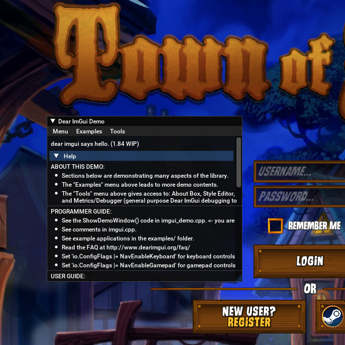

Here's how I was able to get [ImGui](https://github.com/ocornut/imgui) working inside the Unity game engine from a .NET mod loaded with [BepInEx](https://github.com/BepInEx/BepInEx/).



[ImGuiRenderingPlugin](https://github.com/wh0am15533/ImGuiRenderingPlugin) performs the heavy lifting of hooking the relevant graphics interface and acts as an ImGui backend. [ImGui.NET](https://github.com/ImGuiNET/ImGui.NET) is used as a wrapper around the native front-end provided by [cimgui](https://github.com/cimgui/cimgui).

## Dependency Setup

With BepInEx already installed, I built the example project and set up a post-build task to copy it to `<Game>/BepInEx/plugins/ImGuiMod/Mod.dll`. Inside that directory, I needed to provide some dependent Mono libraries which were not already included in the `<Game>/<Game>_Data/Managed/` directory: `System.Runtime.dll` and `System.Runtime.CompilerServices.Unsafe.dll`. The versions of these libraries provided with the repository are unsuitable (`System.Runtime.dll` is a facade with no actual implementation, `System.Runtime.CompilerServices.Unsafe.dll` is a .NET build which is unsuitable to link against the Mono libraries provided by Unity game installs) so I replaced them with compatible counterparts. I installed Mono 6.12.0 and searched `C:\Program Files\Mono\lib\mono` to locate them, but a different release version might be required depending on the age of the game.

`ImGuiRenderingPlugin` needs to be able to perform hooking via Unity's native plugin API, so I had to use the third-party tool bundled in the repo to patch `<Game>_Data/globalgamemanagers` to load both `<Game>_Data/Plugins/cimgui.dll` and `<Game>_Data/Plugins/ImGuiRenderingPlugin.dll` during initialization.

## Debugging and Refactoring

At this point, the example plugin was successfully rendering ImGui inside the process, but improper state management caused rendering to break between scene changes. Let me explain how the existing code worked:
* `TrainerLoader` creates a GameObject with `TrainerMenu` attached
* `TrainerMenu` uses Unity's GUI to create a button that does the following steps when clicked
    * If the `ImGuiPluginHook` GameObject + component pair was not initialized yet, create it. (This bridges our code and `ImGuiRenderingPlugin.dll`)
        * Also, add the `ImGuiDemoWindow` component to the active camera, and subscribe to its `Layout` event to call `TrainerMenu.OnLayout`
* `ImGuiPluginHook` checks if the `ImGuiDemoWindow` component exists on the active camera and adds it where absent
* `ImGuiDemoWindow` implements `Update()` and simply invokes its `Layout` event

This was really frustrating to debug on account of how confusing it was to include all these moving parts for no apparent benefit. I avoided listing anything but the key elements for the sake of brevity. Ultimately, the problem stemmed from `ImGuiDemoWindow`'s event not being subscribed by `TrainerMenu` when `ImGuiPluginHook` re-applied a new `ImGuiDemoWindow` component to the new scene camera. `ImGuiPluginHook` is only initialized once (due to `DontDestroyOnLoad` preserving it between scene changes) and thus `TrainerMenu` is never able to subscribe to the new event.

Here's what I did to fix that:

* Delete `TrainerLoader`
* Move `ImGuiPluginHook` GameObject + component initialization to `BepInLoader.cs` during the mod initialization
* Delete the `TrainerMenu` component
* Rename `ImGuiDemoWindow` to `ImGuiActiveWindow` and delete everything inside
* Implement `ImGuiActiveWindow.Update()` and use it to execute my ImGui code

The modding framework executes the mod through `BepInLoader` which creates `ImGuiPluginHook`. During the next frame, `ImGuiPluginHook` creates and attaches the `ImGuiActiveWindow` component to the active scene camera. `ImGuiActiveWindow` calls a static method to render the GUI in its `Update` function each frame. When the scene changes and deletes the camera, `ImGuiPluginHook` automatically kicks in and we're back to rendering two frames later.

## Input Fall-through

The final problem: ImGui inputs were "falling-through" to Unity UI elements without being consumed. I'm not very familiar with Unity, but I was able to accomplish a simple hack that fixes this well.

```cs
    // ImGuiInput.cs
    public void UpdateMouse() 
    {
        // ...
        
        // disable input events when ImGui is focused
        var inputModule = EventSystem.current?.currentInputModule;
        if (inputModule != null)
        {
            if (inputModule.isActiveAndEnabled && WantCaptureMouse)
            {
                inputModule.DeactivateModule();
            }
            else if (!inputModule.isActiveAndEnabled && !WantCaptureMouse)
            {
                inputModule.ActivateModule();
            }
        }
    }
```

This prevents key inputs from being processed by the game as long as ImGui is trying to trap the mouse. However, the game will lose keyboard focus when the mouse is moved over an ImGui element. It works well enough in practice that I haven't been bothered by it.